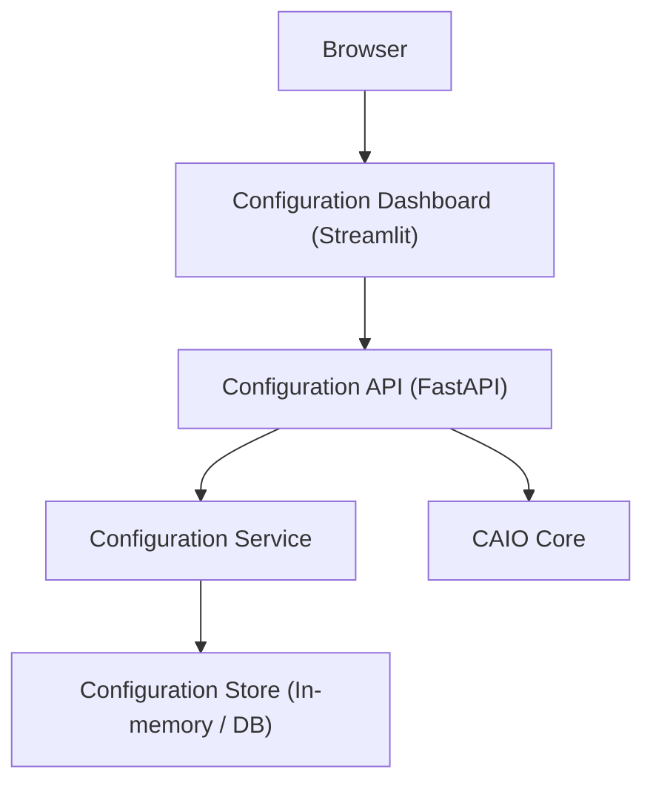

# CAIO Configuration Dashboard Architecture

## Overview

The CAIO Configuration Dashboard provides a web-based UI for configuring operational settings
(policies, constraints, SLOs, tenant settings) with real-time validation, audit logging, and
role-based access control. This dashboard **does not** modify mathematical coefficients or
invariants.

## Component Details

### Frontend Layer
- **Streamlit dashboard** for configuration forms and history views.
- **Real-time validation** (client-side and server-side API validation).
- **Role-based UI** (admin can modify, users can view/validate).

### Backend Layer
- **FastAPI endpoints** for configuration CRUD, validation, audit, export/import.
- **Configuration service** handling versioning and validation.
- **Audit logging** for configuration change tracking.

### Data Layer
- **Configuration storage** (in-memory store in development; schema for DB persistence).
- **Version history** tracked per configuration.
- **Audit change log** for all create/update/delete operations.

### Integration Layer
- **CAIO API integration** with existing auth middleware.
- **Tenant management** support for tenant-scoped configurations.

## Authentication Flow

1. User accesses dashboard and authenticates via CAIO auth middleware.
2. API endpoints enforce roles (`admin` for write operations, `user` for read/validate).
3. Configuration changes are logged to the audit trail with actor attribution.
